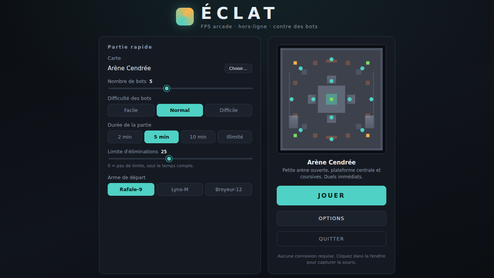
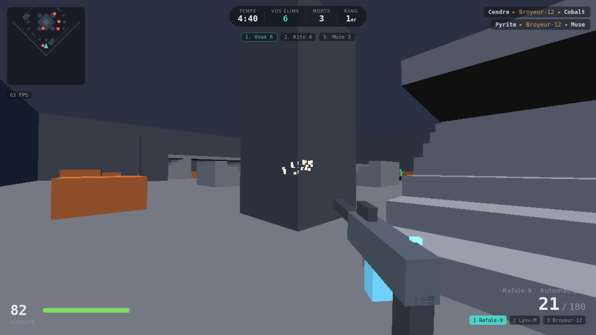
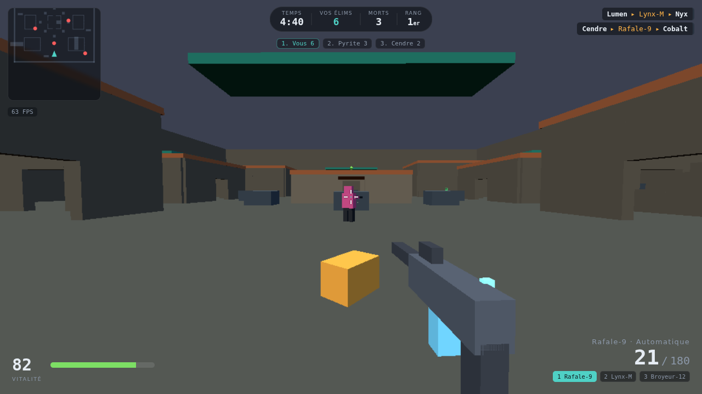
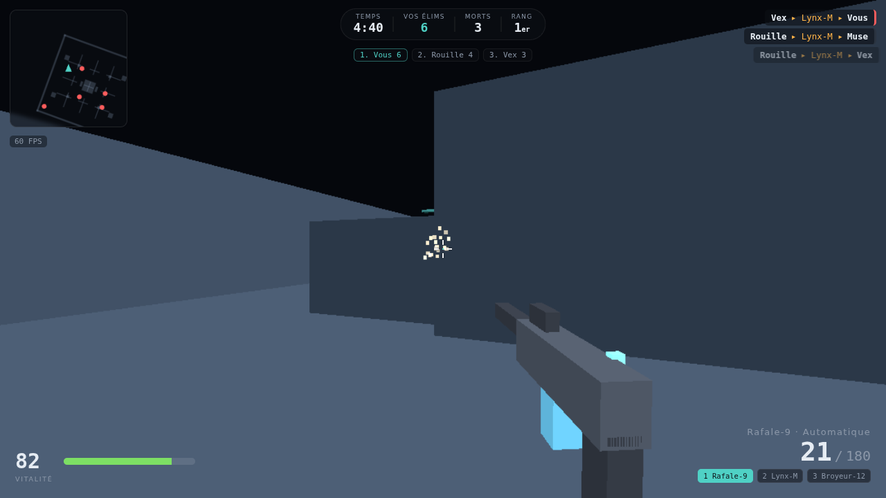
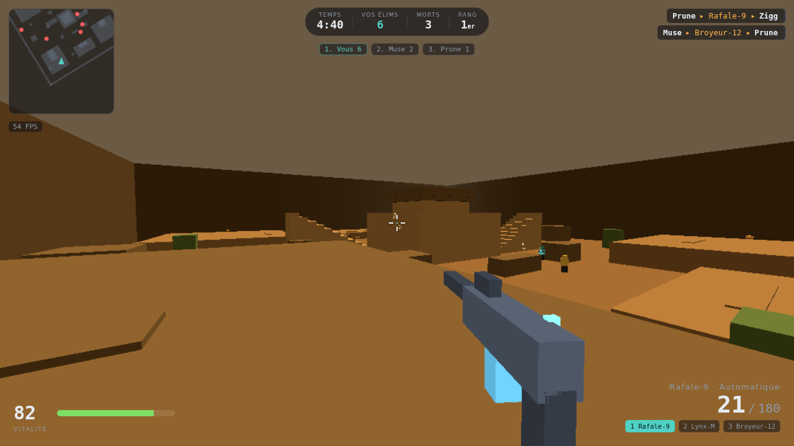

# ÉCLAT — FPS arcade 3D, hors-ligne, contre des bots

Un petit jeu de tir à la première personne, **jouable immédiatement sur un PC modeste**,
sans compte, sans serveur, sans connexion Internet. Quatre cartes originales, trois armes,
jusqu'à onze bots, trois niveaux de difficulté, parties de 2 à 10 minutes.



---

## 1. Pourquoi cette technologie

**Three.js + JavaScript, exécuté dans le navigateur, sans étape de compilation.**

Le cahier des charges dit : gratuit, simple à installer, léger, local, hors-ligne, facile à
modifier. Quatre options se présentaient :

| Option | Installation | Poids | Verdict |
|---|---|---|---|
| Unity / Unreal | plusieurs Go, compte obligatoire | ~100 Mo minimum | disqualifié par la contrainte « simple à installer » |
| Godot | ~100 Mo | ~50 Mo | bon choix, mais un binaire à installer et un format de projet à ouvrir |
| Python + Panda3D / Ursina | pip, dépendances natives | variable | le rendu 3D en Python coûte cher sur machine lente |
| **Three.js, sans build** | **aucune** | **~700 Ko** | **retenu** |

Ce qui a décidé :

- **Rien à installer.** Le navigateur est déjà là, et c'est un moteur 3D accéléré par le GPU.
  Aucun `npm install`, aucun compilateur, aucun *bundler* : les fichiers sont lus tels quels.
- **Three.js est embarqué dans le dépôt** (`vendor/three.module.js`, 687 Ko). Le jeu ne
  contacte jamais le réseau : coupez le Wi-Fi, il tourne à l'identique.
- **Le code reste lisible.** ~3 500 lignes de JavaScript commenté, réparties en modules courts
  qu'on peut ouvrir dans n'importe quel éditeur et modifier sans rien recompiler : on
  enregistre, on recharge la page.
- **Performances maîtrisées.** Le navigateur donne accès à WebGL ; toute la marge vient ensuite
  des choix d'architecture (voir § 8), pas du moteur.

Le seul prérequis est **Python 3**, uniquement pour servir les fichiers en local — les modules
JavaScript ne se chargent pas depuis `file://` pour des raisons de sécurité du navigateur.
Python est préinstallé sur Linux et macOS ; sur Windows il s'installe en deux clics.

---

## 2. Arborescence du projet

```
shellshock-game/
├── index.html              Page unique : canvas, ATH, tous les écrans de menu
├── serve.py                Micro-serveur local (127.0.0.1 uniquement)
├── play.sh                 Lancement Linux / macOS
├── play.bat                Lancement Windows
├── README.md               Ce fichier
│
├── css/
│   └── style.css           Toute l'interface (ATH + menus), aucun framework
│
├── js/
│   ├── main.js             Point d'entrée : cycle de vie et boucle d'affichage
│   ├── config.js           Toutes les constantes de gameplay (armes, difficultés, qualité)
│   ├── settings.js         Préférences persistées dans localStorage
│   ├── input.js            Clavier, souris, verrouillage du pointeur (ZQSD et WASD)
│   ├── collision.js        Physique AABB + lancer de rayons + grille de broad-phase
│   ├── maps.js             Les quatre cartes, décrites en boîtes
│   ├── world.js            Fusion de la géométrie, éclairage, graphe de navigation
│   ├── player.js           Contrôleur première personne
│   ├── weapons.js          État des armes, inventaire, modèles 3D low-poly
│   ├── bots.js             IA : perception, machine à états, combat, évitement
│   ├── effects.js          Traçantes et étincelles, en pool de taille fixe
│   ├── hud.js              ATH, mini-carte, tableau des scores
│   ├── menu.js             Menus, sélection de carte, options, écran de fin
│   └── game.js             Scène, simulation, tirs, score, fin de partie
│
├── vendor/
│   └── three.module.js     Three.js r169 (MIT), embarqué pour le mode hors-ligne
│
└── docs/                   Captures d'écran de cette documentation
```

Aucun autre fichier n'est nécessaire : **pas d'assets à télécharger**. Les modèles sont
générés par le code, les textures n'existent pas (couleurs par sommet), et les sons sont
**synthétisés** à la volée par WebAudio.

---

## 3. Installation

### Linux / macOS

```bash
git clone https://github.com/Brutus3120/shellshock-game.git
cd shellshock-game
./play.sh
```

### Windows

Double-cliquez sur **`play.bat`**.
(Si Python manque : https://www.python.org/downloads/ — cochez « Add Python to PATH ».)

### Manuellement, avec n'importe quel serveur statique

```bash
python3 serve.py            # port 8000, ouvre le navigateur automatiquement
python3 serve.py 8080       # autre port
python3 serve.py --no-open  # sans ouvrir le navigateur
```

Puis ouvrez **http://127.0.0.1:8000/**.

> Le serveur écoute sur `127.0.0.1` et non `0.0.0.0` : le jeu n'est **pas** accessible depuis
> le réseau. Rien ne sort de votre machine.

**Navigateurs testés :** Chrome / Chromium / Edge / Brave et Firefox récents. Un navigateur
supportant WebGL 1 suffit.

### Version en ligne (optionnelle)

Le dépôt contient un workflow qui publie le jeu sur GitHub Pages à chaque envoi sur `main`.
GitHub exige que Pages soit **activé une fois à la main** par le propriétaire du dépôt — un
jeton de workflow n'a pas le droit de créer le site lui-même :

> Settings ▸ Pages ▸ *Build and deployment* ▸ **Source : GitHub Actions**

Après cette activation, relancez le workflow (onglet Actions ▸ *Déployer sur GitHub Pages* ▸
*Run workflow*) et le jeu sera jouable sur https://brutus3120.github.io/shellshock-game/.

Ce n'est qu'un confort pour essayer sans rien installer : le jeu reste **entièrement local**
et, une fois la page chargée, il ne fait plus aucune requête réseau.

---

## 4. Comment lancer une partie

1. Lancez `play.sh` / `play.bat` (ou `python3 serve.py`).
2. Dans le menu : choisissez la carte (**Choisir…**), le nombre de bots, leur difficulté,
   la durée, la limite d'éliminations et l'arme de départ.
3. **JOUER**, puis **cliquez dans la fenêtre** pour capturer la souris.
4. **Échap** met en pause et libère la souris.

---

## 5. Contrôles

| Action | Touche |
|---|---|
| Se déplacer | `Z` `Q` `S` `D` **ou** `W` `A` `S` `D` **ou** les flèches |
| Courir | `Maj` (gauche ou droite) |
| S'accroupir | `Ctrl` ou `C` |
| Sauter | `Espace` |
| Tirer | Clic gauche |
| Viser (précision accrue) | Clic droit maintenu |
| Recharger | `R` |
| Changer d'arme | `1` `2` `3` ou molette |
| Classement en direct | `Tab` (maintenu) |
| Pause / libérer la souris | `Échap` |

Détails de déplacement : tolérance de saut au bord d'une plateforme (*coyote time*),
mémorisation de l'appui sur `Espace`, franchissement automatique des marches jusqu'à 62 cm,
et impossibilité de se relever sous un plafond trop bas.

---

## 6. Contenu du jeu

### Les quatre cartes

| Carte | Style | Ce qu'elle propose |
|---|---|---|
| **Arène Cendrée** | Ouverte, 54 m | Plateforme centrale en gradins, deux coursives hautes, piliers d'angle. Duels immédiats. |
| **Quartier Béton** | Bâtiments, 78 m | Six bâtiments traversables (portes sur les quatre faces), toits accessibles par escaliers et reliés par des passerelles. |
| **Bunker Halogène** | Intérieur, 62 m | Grille de salles fermées, couloirs courts, plafond bas, coursives d'angle. Le terrain du Broyeur-12. |
| **Crête Ocre** | Relief, 84 m | Plateaux étagés, rampes, et une crête centrale dominante mais exposée. Portées longues. |

<table>
<tr>
<td></td>
<td></td>
</tr>
<tr>
<td></td>
<td></td>
</tr>
</table>

Toutes les cartes offrent plusieurs chemins, de la couverture basse, et au moins un niveau de
hauteur. Les points de réapparition sont choisis **le plus loin possible des adversaires
vivants**, ce qui évite de mourir à l'apparition.

### Les trois armes

| Arme | Rôle | Dégâts | Cadence | Chargeur | Portée utile |
|---|---|---|---|---|---|
| **Rafale-9** | Automatique | 16 | 680 coups/min | 30 | 30 m sans perte |
| **Lynx-M** | Précision | 62 (×2,2 à la tête) | 195 coups/min, coup par coup | 8 | 110 m sans perte |
| **Broyeur-12** | Courte portée | 9 plombs × 11 | 78 coups/min | 6 | 7 m, s'effondre au-delà |

Chaque arme a ses propres munitions, sa dispersion (hanche / visée / en mouvement), son recul
et sa dégressivité de dégâts avec la distance. Les tirs à la tête sont détectés et sonorisés.

### Les bots

Ils patrouillent, cherchent le joueur, **s'affrontent entre eux**, tirent par rafales, se
replient à couvert quand leur vitalité tombe, se débloquent tout seuls s'ils butent sur un
obstacle et réapparaissent après 3 secondes.

| Difficulté | Précision | Réaction | Vitesse | Usage de la couverture | Dégâts infligés |
|---|---|---|---|---|---|
| **Facile** | très approximative | 0,60 s | 80 % | 15 % | 65 % |
| **Normal** | correcte | 0,32 s | 95 % | 40 % | 85 % |
| **Difficile** | chirurgicale, avec anticipation | 0,16 s | 106 % | 70 % | 100 % |

L'IA n'utilise **ni A\*, ni navmesh édité à la main** : le graphe de navigation est échantillonné
automatiquement au chargement de la carte. Créer une carte suffit donc à la rendre jouable par
les bots — rien à annoter.

### Déroulement d'une partie

Match à mort libre : chrono configurable (2 / 5 / 10 min ou illimité), limite d'éliminations
réglable, score et rang affichés en permanence, fil des éliminations, classement complet à
`Tab`, puis écran de fin avec classement final, **Rejouer** et **Menu principal**.

---

## 7. Réglages pour améliorer les FPS sur un PC peu puissant

Dans **Options** :

1. **Qualité graphique → Bas.** C'est le levier principal : la résolution de rendu passe à 65 %
   (≈ 2,4× moins de pixels à calculer), les ombres sont coupées et le brouillard se rapproche.
   L'ATH, lui, reste net : il est en HTML, pas en 3D.
2. **Champ de vision → 70-75°.** Moins de décor visible à l'écran, donc moins à dessiner.
3. **Mini-carte → désactivée.** Elle coûte peu (15 rafraîchissements/s) mais ce n'est pas rien
   sur un processeur ancien.

En dehors du jeu :

4. **Réduisez la taille de la fenêtre** (ne jouez pas en plein écran 4K). Le coût est
   proportionnel au nombre de pixels : une fenêtre en 1280×720 est trois fois moins chère
   qu'un 4K.
5. **Moins de bots** : 3 ou 4 au lieu de 11. Chaque bot coûte de l'IA, de la physique et un
   maillage.
6. **Préférez les cartes Arène Cendrée ou Bunker Halogène**, plus compactes que Crête Ocre.
7. **Fermez les autres onglets**, et activez l'accélération matérielle du navigateur
   (`chrome://gpu` doit afficher *WebGL: Hardware accelerated*).
8. Sur un portable, **branchez le secteur** et passez en mode « performances » : le bridage
   sur batterie divise couramment la fréquence d'images par deux.

Le compteur d'images/s en haut à gauche permet de mesurer chaque changement plutôt que
de le deviner.

---

## 8. Comment le jeu reste léger (notes techniques)

Les décisions qui font la différence, si vous voulez modifier le projet sans le ralentir :

- **Toute la carte est dessinée en un seul appel.** Les centaines de boîtes sont fusionnées
  au chargement en une seule géométrie à couleurs par sommet (`world.js`). Une carte coûte
  donc autant qu'un cube.
- **Aucune texture, aucun fichier d'asset.** Les modèles sont des boîtes, les couleurs sont
  dans la géométrie, les sons sont synthétisés (`audio.js`). Le jeu entier tient dans ce qui
  serait une seule texture 2K dans un jeu classique.
- **Deux lumières au maximum**, et les ombres uniquement en qualité « Haut ».
- **Collision purement AABB** avec grille uniforme (`collision.js`) : quelques comparaisons
  par acteur et par image. Les pentes sont remplacées par des marches, ce qui supprime tout
  un pan de complexité sans rien enlever au gameplay.
- **Les tirs sont instantanés** (*hitscan*), pas des projectiles simulés.
- **Rien n'est alloué pendant le combat.** Les traçantes et les étincelles vivent dans des
  pools de taille fixe (`effects.js`) : pas de ramasse-miettes, donc pas de micro-saccades.
- **L'IA ne réfléchit pas à 60 Hz.** La perception tourne à ~8 Hz, la mini-carte à 15 Hz.
- **L'interface est en DOM.** Le GPU n'en voit rien et le texte reste net même quand la
  résolution de rendu est réduite.

### Où modifier quoi

| Vous voulez… | Fichier |
|---|---|
| Rééquilibrer une arme, la difficulté des bots, les presets graphiques | `js/config.js` |
| Ajouter ou retoucher une carte | `js/maps.js` |
| Changer le comportement des bots | `js/bots.js` |
| Régler le déplacement du joueur | `js/config.js` (`PLAYER`) et `js/player.js` |
| Modifier l'apparence de l'ATH | `css/style.css` et `index.html` |

**Ajouter une cinquième carte** tient en trois étapes : écrire une fonction qui renvoie des
boîtes dans `maps.js`, l'ajouter à `MAPS` et à `MAP_ORDER`. L'aperçu du menu, la mini-carte,
la navigation des bots et les points de réapparition se construisent tout seuls.

---

## 9. Pistes pour une version 2

**Gameplay**
1. Modes de jeu supplémentaires : équipes (2 camps), capture de zone, dernier survivant.
2. Grenades et un équipement utilitaire (mine de proximité, écran de fumée).
3. Armes secondaires, corps à corps, et un petit choix d'équipement avant la partie.
4. Accessoires d'arme modifiant les statistiques (canon long, chargeur étendu).
5. Progression locale : statistiques cumulées, records personnels par carte.

**Intelligence artificielle**
6. Vraie recherche de chemin (A\* sur le graphe existant) pour des trajets plus malins qu'un
   simple pilotage direct.
7. Coordination entre bots : prise à revers, priorité aux objets à ramasser, comportement
   d'escouade.
8. Personnalités de bots (agressif, camper, éclaireur) pour varier les affrontements.

**Contenu et présentation**
9. Éditeur de cartes intégré, écrivant directement le format de `maps.js`.
10. Animations de personnages (marche, rechargement) et ragdoll simplifié à la mort.
11. Décalques d'impact, douilles éjectées, meilleurs retours visuels de dégâts.
12. Ambiance sonore : pas des adversaires, réverbération différente en intérieur.

**Technique**
13. Boucle à pas fixe avec interpolation du rendu, pour un comportement identique quelle que
    soit la fréquence d'images.
14. Manette et remappage complet des touches.
15. Mode hors-ligne installable (PWA), pour lancer le jeu sans même démarrer le serveur.
16. Multijoueur local en écran partagé — le seul multijoueur compatible avec la contrainte
    « pas de serveur ».

---

## 10. Licence et contenu

Code du jeu : à réutiliser librement.
Three.js est distribué sous licence MIT (voir l'en-tête de `vendor/three.module.js`).

**Tout le contenu est original** : les cartes, les noms d'armes et de personnages, la direction
artistique, les couleurs et les sons ont été créés pour ce projet. Aucun asset, aucune carte et
aucun élément graphique n'est repris d'un jeu existant.
